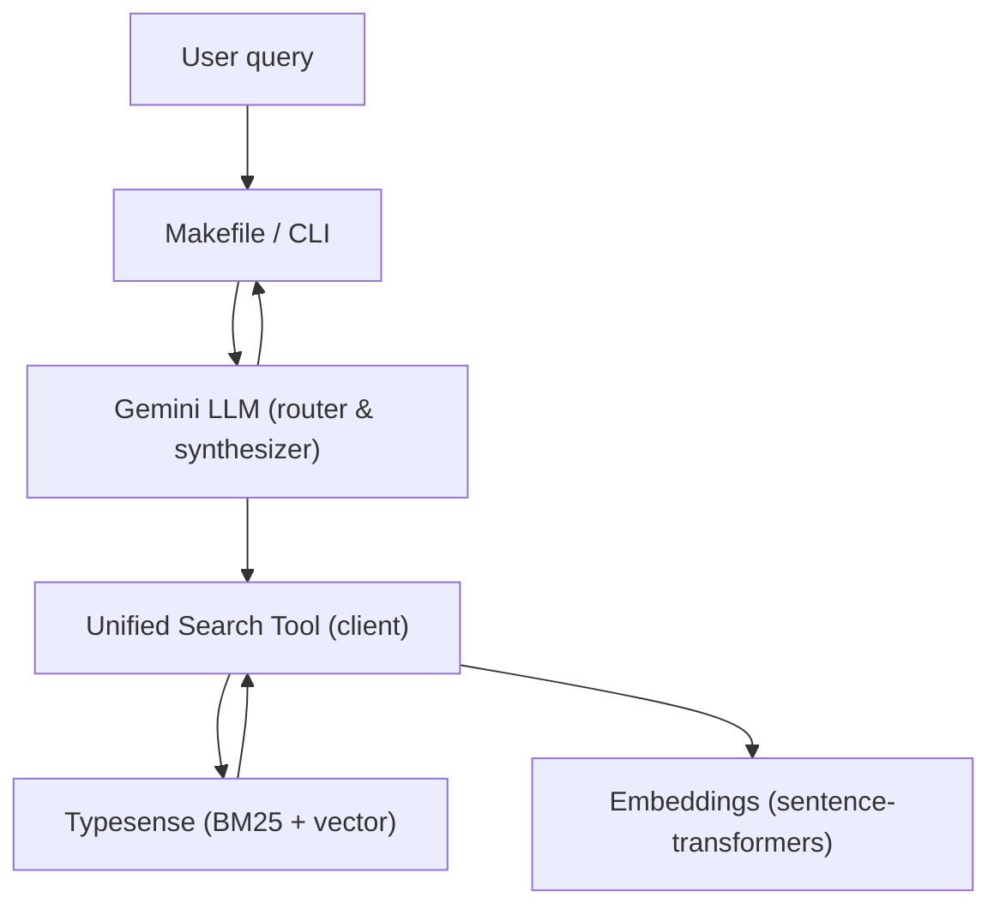
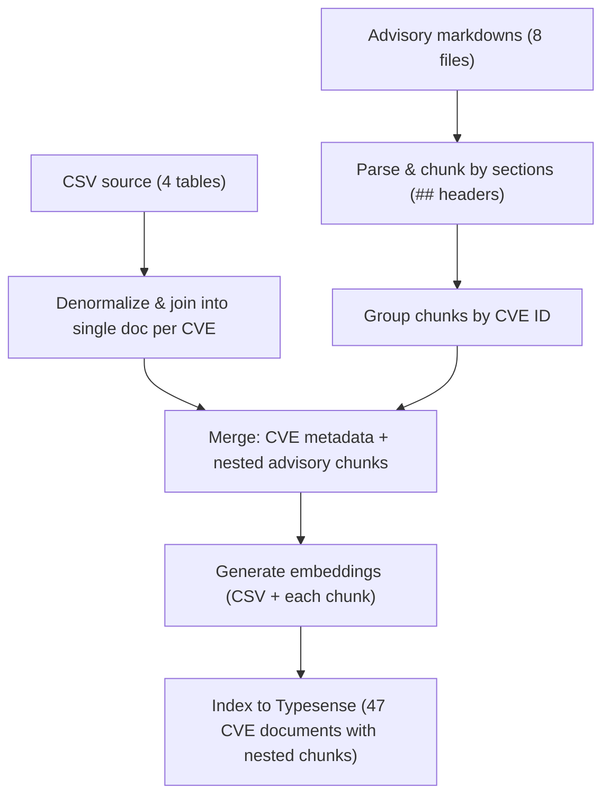
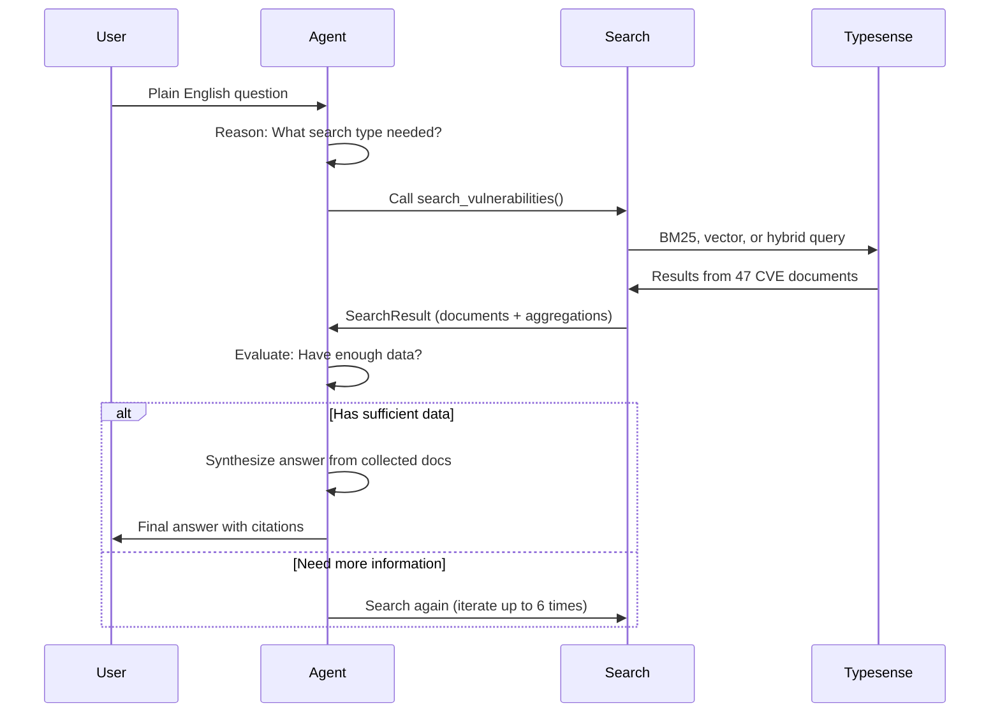

# Hybrid RAG System for Security Vulnerabilities

A compact, production-minded hybrid RAG system that answers plain-English questions about security vulnerabilities by combining structured CVE metadata and unstructured advisory content. This project serves as an exercise to test the capabilities of search engines like Typesense for RAG applications when dealing with semi-structured/structured data and analytics requirements.

I decided not to use any high-level RAG frameworks to learn how to implement the ReAct pattern, tool calling, and core retrieval/synthesis logic from scratch using low-level APIs. **This approach is not recommended for real-world scenarios** - for production-ready implementations using high-level agent frameworks, see my [recipe-agent](https://github.com/javiramos1/recipe-agent) repository.

I discovered that for structured and especially semi-structured data, search engines are superior because they provide hybrid search including keyword search, which is excellent for finding CVEs and other IDs in semi-structured data as well as text chunks. On top of that, faceting allows aggregation on numeric fields, so a single query provides text fields, chunks, and aggregations simultaneously - this is very powerful.

## Quick start (use the Makefile)

Always use the project's Makefile for setup, ingest, run and tests. The Makefile centralizes environment, dependencies and Docker orchestration so you can reproduce runs reliably.

**IMPORTANT**: You need a Google API key to run this system. Get one free at [Google AI Studio](https://aistudio.google.com/app/apikey).

From the repository root:

```bash
cd solution
make setup    # create venv, install deps, start Typesense, setup .env
# The setup will prompt you to paste your Google API key (or you can add it to .env manually)
make ingest   # build embeddings and index documents into Typesense
```

Run or test:

```bash
make run                  # interactive CLI
make query Q="<your question>"  # single-query mode
make test                 # run the full test suite (31 unit tests)
make int-tests            # run integration tests (17 comprehensive queries)
```

**Note**: If you skip the API key during setup, edit `solution/.env` and add:

```bash
GOOGLE_API_KEY=your_api_key_here
```

## Makefile summary

This table shows the most useful targets you'll use when working with the system.

| Command | Purpose |
| --- | --- |
| `make setup` | Full setup: venv + install + docker-up |
| `make install` | Install production deps |
| `make install-dev` | Install dev/test deps |
| `make docker-up` / `make docker-down` | Start / stop Typesense container |
| `make ingest` | Run data ingestion and index 47 CVE documents |
| `make run` | Start interactive CLI (REPL) |
| `make query Q='...'` | Run a single question and exit |
| `make test` | Run 31 unit tests |
| `make int-tests` | Run 17 integration tests (all RAG types) |
| `make lint` / `make format` / `make type-check` | Code quality checks |
| `make clean` / `make reset` | Remove venv / reset Docker state |
| `make zip` | Create distribution archive (tar.gz, excludes typesense-data, venv, cache) |

## Assumptions

This project is tailored for a specific use case and data profile:

**Use case**: Vulnerability search and basic analytics over semi-structured data (CVE metadata + advisory text). The system assumes a search engine is already operational; I'm reusing it rather than building from scratch.

**Data shape**: Semi-structured (not fully relational, not purely unstructured). Structured metadata (CVE ID, CVSS, versions) paired with advisory documents that benefit from semantic search.

**Scale & simplicity**: I prioritize avoiding data duplication across different formats and maintaining consistency. Simplicity matters as much as scale—if the system becomes harder to reason about, it's harder to maintain.

**Learning goals**: This is a deliberate learning exercise where I implemented everything from scratch using low-level APIs to deeply understand ReAct patterns, tool calling, and hybrid search mechanics. **This approach is not recommended for production** - see my [recipe-agent](https://github.com/javiramos1/recipe-agent) for a high-level agent implementation. My hands-on approach revealed the superiority of search engines over pure vector databases for structured/semi-structured data.

**When this approach may not fit:**

- If analytics and aggregations dominate your workload over search, a data warehouse (Snowflake, BigQuery) is better suited than a search engine.
- If data is heavily unstructured (pure text documents with minimal metadata), a vector-only system may be simpler than hybrid search.
- If strict ACID compliance for transactional updates is required, a traditional database is necessary.

For the given dataset (47 CVEs with semi-structured advisories), this hybrid retrieval pattern efficiently balances search capability with operational simplicity.

## What this project does (short)

- Supports three query types via one unified interface: structured-only (CSV aggregation/filters), unstructured-only (semantic advisory search), and hybrid (both combined).  
- Uses Typesense to index CVE-centric documents (one document per CVE, with nested advisory chunks for rich content search).
- Uses Gemini (configurable via env) to route queries, call the search tool, and synthesize answers with citations.

## Design choices and tech stack

- Search engine: Typesense 29.x (running in Docker). Chosen because it natively supports BM25 keyword search, vector similarity, faceting and aggregations in one system. That lets us issue a single atomic insert per document and run hybrid queries without stitching results across systems.
- LLM: Google Gemini (model configurable via `GEMINI_MODEL` env var) for intent routing and final answer synthesis.
- Embeddings: sentence-transformers/all-MiniLM-L6-v2 (384-dim) — fast CPU inference and small model size.
- Data processing: Polars for CSV joins/denormalization; markdown chunking preserves sentence/code boundaries.

## Technology Stack

**Search Engine**: Typesense 29.0

- Native hybrid search (BM25 + vector), automatic rank fusion
- Faceted search and aggregations
- Running in Docker for reproducibility

**LLM**: Google Gemini 3 (Flash/Pro, configurable)

- Automatic function calling (no prompt engineering)
- Fast inference, large context window
- Configurable via `GEMINI_MODEL` env var

**Embeddings**: sentence-transformers/all-MiniLM-L6-v2

- 384-dimensional vectors, fast CPU inference
- No GPU required
- 80MB model, ~1000 sentences/sec on CPU
- Good quality for small-to-medium datasets

**Data Processing**: Polars, markdown, beautifulsoup4

- Polars: 10-100x faster than pandas for CSV operations
- Markdown parsing and chunking at semantic boundaries

**Infrastructure**: Docker Compose

- Reproducible Typesense setup with health checks
- One-command environment: `make setup`

### Why all-MiniLM-L6-v2 for embeddings?

I chose this model because it hits the sweet spot for prototype-to-production RAG systems with small datasets:

**Practical reasons:**

- **Fast**: Encodes text in ~2-3ms on CPU, no GPU needed. Ingestion takes 10-15 seconds total.
- **Small**: 80MB model fits in memory easily, won't slow down container startup.
- **Good enough**: Trained on diverse text including technical docs. Security terms like "XSS", "SQL injection", "CVE" are well-represented.
- **Free**: No API costs, works offline, no rate limits.

**When it matters less:**

With 47 CVEs and 8 advisories, embedding quality matters less than chunking strategy. A 15% quality gap vs. larger models (all-mpnet-base-v2, OpenAI embeddings) is negligible when you only have 60-80 chunks to search through.

### Why Typesense? (Design Decision)

I evaluated four major search approaches and chose Typesense because it demonstrates the superiority of search engines over pure vector databases for structured and semi-structured data:

| Approach | Structured | Semantic | Hybrid | Complexity |
| --- | --- | --- | --- | --- |
| PostgreSQL only | ⭐⭐⭐⭐⭐ | ❌ | ❌ | Simple |
| PostgreSQL + pgvector | ⭐⭐⭐⭐⭐ | ⭐⭐⭐⭐ | ⭐⭐⭐ | High |
| **Typesense** | ⭐⭐⭐⭐ | ⭐⭐⭐⭐⭐ | ⭐⭐⭐⭐⭐ | Low |
| SQLite + FAISS | ⭐⭐⭐⭐⭐ | ⭐⭐⭐⭐⭐ | ⭐⭐⭐ | Medium |

**Why search engines like Typesense are superior for structured/semi-structured data:**

- **Native Hybrid Search**: Single query combines BM25 (keyword) + vector similarity with automatic rank fusion. Perfect for finding CVEs by ID (keyword) while also understanding advisory content (semantic).
- **Faceting for Aggregations**: Built-in aggregation capabilities allow computing statistics on numeric fields (CVSS scores, version counts) in the same query that retrieves text content.
- **One Document, Dual-Indexed**: All data in one Typesense collection with both keyword and vector indexes. No metadata duplication. Vector search includes two embedding levels: (1) 47 CSV embeddings (CVE descriptions) for full-dataset semantic coverage, and (2) ~60-80 nested advisory chunk embeddings for fine-grained search within the 8 CVEs that have detailed advisories.
- **Single Query Power**: Unlike vector databases, one search call returns filtered results, semantic matches, aggregations, and facets simultaneously - extremely powerful for semi-structured data.

**Key insight for structured/semi-structured data:** Search engines excel where vector databases struggle. They handle IDs, metadata, and aggregations natively while providing semantic search, making them ideal for datasets like CVEs that have both structured fields (IDs, scores, versions) and unstructured content (advisory text).

#### CVE Document Structure in Typesense

Each CVE is a single denormalized document with both structured metadata and nested advisory content:

```text
CVE Document (47 total):
├── Top-level fields (searchable)
│   ├── cve_id: "CVE-2024-1234"
│   ├── package_name: "express-validator"
│   ├── ecosystem: "npm"
│   ├── severity: "Critical"
│   ├── affected_versions: ["1.0.0", "1.0.1"]
│   ├── fixed_version: "1.0.2"
│   ├── content: "Description from CSV"
│   └── embedding: [0.123, -0.456, ...]          ← CSV description embedding
│
└── Nested advisory_chunks: [
    ├── chunk 1: {section: "summary", content: "...", embedding: [...]}
    ├── chunk 2: {section: "remediation", content: "...", embedding: [...]}
    └── chunk 3: {section: "testing", content: "...", embedding: [...]}
]
```

#### When Vector Search Is Used

| Query Type | CSV Embedding | Advisory Embedding | How It Works |
| --- | --- | --- | --- |
| **Keyword (BM25)** | ❌ Not used | ❌ Not used | Pure text matching on all fields (BM25 relevance scoring) |
| **Semantic (Vector)** | ✅ Searched | ✅ Searched | Encodes query to embedding, finds nearest neighbors in both top-level embedding field AND nested advisory_chunks.embedding |
| **Hybrid** | ✅ Searched | ✅ Searched | Combines BM25 keyword matching + vector similarity with automatic rank fusion (alpha=0.5) |

**Key insight:** Typesense automatically searches nested embeddings, so both CSV descriptions (for full coverage) and advisory chunks (for granularity) are indexed and queried together.

**Why not the others:**

- **PostgreSQL + pgvector**: Duplicate metadata across chunks OR maintain complex joins. Manual result merging needed.
- **SQLite + FAISS**: Two separate systems with significant operational overhead:
  - FAISS is an in-memory index (no persistence without custom serialization)
  - No native filtering in FAISS—retrieve all nearest neighbors, then filter in application code (inefficient)
  - Manual rank fusion: run SQL keyword search AND FAISS vector search separately, then merge results (complex logic)
  - No faceting/aggregations in FAISS—must post-process results in Python
  - Requires maintaining two schemas and keeping them in sync (data consistency burden)
  - Scaling becomes complex: FAISS doesn't partition vectors horizontally; SQLite is single-writer
  - No distributed indexing: both FAISS and SQLite struggle at scale (terabytes of vectors, millions of CVEs)
- **PostgreSQL only**: Can't do semantic search. Simple text search.

**Real-world context:** I researched public services like [Snyk Security](https://security.snyk.io/) and observed they rely on search engines. This influenced my assumption that a maintained search engine is a reasonable operational dependency for vulnerability search. You can reuse a centralized index rather than running separate SQL and vector stores. In practice, search engines handle semi-structured advisory documents better than raw vector DBs because they combine token-level heuristics (keyword) with embeddings for conceptual matches.

**Additional trade-offs:**

- Elasticsearch is excellent at aggregations and scales well, but requires careful schema and cluster tuning; Typesense gives a simpler path with native vector support.
- PostgreSQL remains the best for heavy analytical SQL workloads, but for hybrid retrieval + filtering + ranking, a search engine reduces glue code and complexity.

## Architecture (overview)



### Data flow (ingest)



### How queries work (ReAct pattern)

The agent uses **ReAct (Reasoning + Acting)** to iteratively search and synthesize answers:



**Flow (high-level):**

1. User asks a question in plain English
2. Gemini decides: search for more data or synthesize an answer?
3. If searching: calls `search_vulnerabilities()` with appropriate parameters
   - **Keyword** (BM25): Metadata filtering, aggregations → "List Critical npm vulnerabilities"
   - **Semantic** (vector): Advisory understanding → "Explain SQL injection"
   - **Hybrid**: Both combined → "How to fix CVE-2024-1234?"
4. Results collected; Gemini evaluates: enough info to answer?
5. If yes: synthesize final answer with citations and sourcing
6. If no: iterate and search again (max 6 iterations)

**Why ReAct?** Allows natural iteration—search, evaluate, refine. Stops automatically when sufficient context is gathered. No hardcoded stopping rules.

## Configuration

Copy `.env.example` into `solution/.env` and set the required keys.

Important vars:

```bash
GOOGLE_API_KEY=...           # Gemini API key
GEMINI_MODEL=gemini-3-flash-preview
VECTOR_SEARCH_K=100          # neighbors for vector search
HYBRID_SEARCH_ALPHA=0.5      # 0=keyword-only, 1=vector-only
LOG_LEVEL=INFO

# Score-based document filtering
MIN_SCORE=0.3                # Minimum relevance score (0-1) to include a document
MAX_GAP=0.2                  # Maximum score gap between consecutive documents (removes noise)
```

**Score Filtering Details:**

The agent applies two-stage filtering after sorting documents by relevance score:

1. **MIN_SCORE** (default: 0.3): Removes all documents with combined score below this threshold. This filters out marginally relevant results.

2. **MAX_GAP** (default: 0.2): Detects and removes "noise" documents. If the gap between consecutive document scores exceeds MAX_GAP, that document and all following documents are removed. This is useful when there's a clear separation between highly relevant and marginally relevant documents (e.g., score drops from 0.8 to 0.5, gap of 0.3 exceeds threshold).

**Score Calculation:**

Each document receives a combined score using Z-score normalization:

```
combined_score = (text_match * 0.6) + ((1.0 - vector_distance) * 0.4)
```

Where:
- `text_match` (0-1): BM25 keyword relevance, normalized using Z-score (see below)
- `vector_distance` (0-1): Cosine distance to query embedding, inverted so lower distance = higher score
- Weights: 60% keyword relevance, 40% semantic similarity

**Z-Score Normalization for BM25:**

BM25 scores from Typesense are unbounded integers. I normalize them using Z-score (standardization):

$$\text{z-score} = \frac{\text{score} - \mu}{\sigma}$$

Then map to [0, 1] range using:

$$\text{normalized} = \max(0.0, \min(1.0, \frac{\text{z-score} + 3}{6}))$$

This uses the 68-95-99.7 rule (±3σ covers 99.7% of normal distribution) and is the industry-recommended approach for normalizing BM25 scores in hybrid search (used by OpenSearch, Elasticsearch, etc).

**Logging:**

When documents are filtered, the agent logs at INFO level:

```
📊 Document filtering applied: 5 → 3 (2 removed: 0 below MIN_SCORE=0.3, 2 filtered by MAX_GAP=0.2)
```

All commands in this repo are designed to run via the Makefile so environment loading and Docker orchestration remain consistent.

## Chat History (Multi-turn conversations)

The agent maintains a conversation history that it uses intelligently:

- **Remembers context**: Previous questions and answers are passed to Gemini in the system prompt
- **Avoids redundant searches**: If the answer is already in history, Gemini answers directly without calling the search tool
- **Improves search queries**: Gemini replaces vague references (like "this vulnerability") with actual CVE IDs from previous answers, making searches more precise
- **Configurable**: Keep last 3 messages by default or set `MAX_CHAT_HISTORY=5` for longer memory

Example: User asks "What is CVE-2024-1234?" → Agent searches and answers. User then asks "What's the CVSS score of this?" → Agent checks history, sees CVE-2024-1234 was discussed, and answers directly from that context.

## Debug Mode

View search details and LLM decision-making:

```bash
make query Q="your question" D=1      # Shows search results, aggregations, and iteration prompts
make run --debug                       # Interactive mode: after each answer, you're prompted to view search results
```

Debug output shows:

- **Search history**: All queries executed, result counts
- **Documents collected**: Relevant CVE records retrieved (max 5 shown)
- **Aggregations & stats**: Counts, averages, facets used to answer the question
- **Iteration prompts** (D=1 only): Raw LLM prompts for each iteration—useful for understanding why the agent searched or answered

## Troubleshooting (common issues)

- Typesense not running: `make docker-up` then `make docker-logs` to inspect logs. Use `make docker-down` then `make docker-up` to restart.
- Port conflicts on 8108: find and kill the process using the port. Prefer changing Docker host mapping if necessary.
- Missing API key: ensure `GOOGLE_API_KEY` is set in `solution/.env` and re-source the file.
- Data not indexed: re-run `make ingest`. If indexing still fails, inspect Typesense collection with curl against `http://localhost:8108/collections`.
- Tests failing: confirm Typesense is healthy (`make health`), re-ingest (`make ingest`) and run `make test`.

## Code structure

```text
solution/
├── main.py                  # CLI entry point (interactive + single-query modes)
├── Makefile                 # All workflows (setup, ingest, run, test, lint)
├── requirements.txt         # Pinned dependencies
├── docker-compose.yml       # Typesense 29.0 container config
├── .env.example             # Configuration template
├── src/
│   ├── agent.py            # Gemini LLM orchestration (routing & synthesis)
│   ├── search_tool.py      # Unified search interface (keyword/semantic/hybrid)
│   ├── ingest.py           # Data pipeline (denormalize, chunk, embed, index)
│   ├── prompts.py          # LLM system prompts and tool declarations
│   ├── logger.py           # Structured logging utilities
│   └── utils.py            # Helper functions (retries, data validation)
└── tests/
    ├── test_agent.py       # Agent initialization and synthesis tests
    ├── test_search_tool.py # Search (keyword/semantic/hybrid/filters/agg)
    └── test_ingest.py      # Ingestion pipeline tests
```

## Key implementation details

### ReAct agent with embedding caching

The agent implements **ReAct (Reasoning + Acting)** with automatic stopping:

- Iteratively calls `search_vulnerabilities()` and collects documents/aggregations
- **Automatic decision logic**: Synthesize answer when:
  - 3+ CVE documents collected, OR
  - Aggregation/statistics data available, OR  
  - 3+ different searches attempted, OR
  - Broad search ("*") returns 0 results (data doesn't exist)
  - Text response received (indicates thinking completed)
- Max 6 iterations; typically finishes in 1-3 iterations

**Performance optimization**: The question embedding is computed once and cached across all ReAct iterations (avoids re-encoding in semantic/hybrid searches).

### Single unified search function

Instead of separate search paths for CSV vs. advisory queries, I expose one `search_vulnerabilities()` with flexible parameters:

```python
search_vulnerabilities(
    query: str,
    search_type: "keyword|semantic|hybrid",  # How to search
    cve_ids, ecosystems, severity_levels,    # Explicit filters
    min_cvss_score, additional_filters,      # Flexible overrides
    facet_by, group_by, sort_by,            # Aggregation & ranking
)
```

Gemini automatically determines the best parameters. No hardcoded parsing rules.

### CVE-centric document design with nested advisory chunks

Each CVE is a single document containing:

- **Structured fields**: CVE ID, package name, ecosystem, severity, CVSS score, versions, vulnerability type, `has_advisory` (boolean flag)
- **Unstructured fields**: Description (from CSV) + nested advisory chunks array
- **Embedding**: Generated from CSV description
- **Nested advisory_chunks**: Array of objects containing:
  - `content`: Chunk text (preserves code blocks intact)
  - `section`: Semantic category (summary, remediation, testing, best_practices, details)
  - `is_code`: Boolean flag for code block preservation
  - `index`: Position within the advisory
  - `embedding`: Separate embedding for semantic search

**The `has_advisory` field** is a faceted boolean that distinguishes the 8 CVEs with detailed advisories from the 39 without. Enables queries like:

- `additional_filters="has_advisory:true"` to prioritize CVEs with code examples and remediation steps
- `facet_by="has_advisory"` to analyze documentation coverage (8 documented, 39 metadata-only)

This maintains the **47 vulnerabilities** contract while enabling rich advisory content search. Advisory chunks are nested sub-documents, not separate top-level documents.

### Advisory integration with section-based chunking

The 8 advisory markdown files are parsed with **section-aware chunking**—a pragmatic strategy that respects document structure rather than forcing arbitrary splits:

**How it works:**

1. **Section splitting**: Split advisories by `##` markdown headers (e.g., "Remediation", "Code Examples"). Each section discusses one topic, so headers are natural semantic boundaries.
2. **Code preservation**: When a section contains code blocks (```), keep the entire section intact. Never split mid-code—a Python function isn't useful if chopped into pieces.
3. **Text chunking**: Text-only sections get split at sentence boundaries, targeting ~500 characters per chunk. This keeps related sentences together while staying within optimal embedding length (~150 tokens).
4. **Nested storage**: Chunks stay grouped by CVE and stored as nested arrays within parent CVE documents.

**Why this approach?**

Security advisories have strong structure (headers define topics). I leverage that instead of using more complex semantic chunking that would:

- Require embedding every sentence just to find split points (slow, expensive)
- Ignore the structure humans already built into the markdown
- Still need special handling for code blocks anyway

For 8 well-structured advisory documents, simple section-based chunking gives us the benefits of semantic chunking (topical coherence) without the complexity.

**Benefits:**

- **Analytics integrity**: 47 CVE documents total (not 95+ separate chunks)
- **Code preservation**: Entire code examples remain searchable as units
- **Semantic search**: Separate embeddings for CSV metadata and advisory chunks
- **Section awareness**: Chunks tagged by type (summary, remediation, testing, best_practices, details)
- **Context preserved**: No mid-sentence or mid-code splits

**Real-world chunking results:**

- 8 advisory files → ~60-80 chunks total
- Code sections: Kept whole (some 800+ chars for full examples)
- Text sections: 200-500 chars each, complete sentences
- Each chunk knows: CVE ID, section type, whether it contains code

### Section categories and filtering

Advisory chunks are tagged with **5 semantic section types** for precise filtering and analytics:

| Section Type | Description | Filter Syntax |
| ------------- | ------------- | --------------- |
| `summary` | Overview and description | `advisory_chunks.{section:=summary}` |
| `remediation` | Fix steps and patches | `advisory_chunks.{section:=remediation}` |
| `testing` | Verification and test procedures | `advisory_chunks.{section:=testing}` |
| `best_practices` | Security recommendations | `advisory_chunks.{section:=best_practices}` |
| `details` | Attack vectors, technical details | `advisory_chunks.{section:=details}` |

**Usage examples:**

```python
# Find CVEs with testing documentation
search_vulnerabilities(
    query="*", 
    search_type="keyword",
    additional_filters="advisory_chunks.{section:=testing}"
)

# Analyze documentation completeness by ecosystem
search_vulnerabilities(
    query="*",
    search_type="keyword", 
    facet_by="ecosystem,advisory_chunks.section"
)

# Multi-section filtering (remediation AND testing)
additional_filters="advisory_chunks.{section:=remediation} && advisory_chunks.{section:=testing}"
```

**Metadata fields for faceting:**

- `ecosystem`: npm, pypi, maven, etc.
- `severity`: Critical, High, Medium, Low
- `has_advisory`: true/false (8 CVEs have detailed advisories)
- `vulnerability_type`: SQL Injection, XSS, etc.
- `advisory_chunks.section`: The 5 section types above
- `advisory_chunks.is_code`: true/false (code block presence)


## Features & requirements met

✅ **Three query types working:**

- Structured-only: filter/aggregate CVE metadata  
- Unstructured-only: semantic search advisory content  
- Hybrid: combine both with rank fusion

✅ **Natural language interface** — no query syntax, plain English questions  
✅ **Accurate citations** — answers include CVE IDs, versions, CVSS scores  
✅ **Core RAG from scratch** — no forbidden frameworks (LangChain, LlamaIndex, etc.)  
✅ **Comprehensive tests** — 31 unit tests + 17 integration tests, all passing  
✅ **No duplicates** — CVE-centric ingestion ensures 47 unique documents  
✅ **Production-ready** — Docker Compose, env config, error handling, logging

## Performance

**Ingestion**: 10-15 seconds (CSV denormalization + advisory merging + embeddings + indexing) using Polars

**Queries**: 1.5-4 seconds total

- Typesense search: 20-100ms
- Gemini synthesis: 1-3 seconds

**Data**: 47 CVE documents (each with metadata + nested advisory chunks from 8 advisory files)

**Search**: Hybrid (BM25 + vector) across CVE metadata + nested advisory chunks

## Getting Started

1. **Run it first:**

   ```bash
   cd solution
   make setup
   make ingest
   make run    # ask a question
   ```

2. **Run tests:**

   ```bash
   make test       # 31 unit tests
   make int-tests  # 17 integration tests (all RAG types)
   ```

3. **Understand the flow:**

   - `src/agent.py` — main orchestration logic
   - `src/search_tool.py` — unified search implementation
   - `src/ingest.py` — how data gets into Typesense

4. **Explore the code:**

   - Start with `src/agent.py` for the orchestration pattern, this is mainly boiler plate code, not the main focus
   - Check `src/search_tool.py` for the unified search interface
   - See `src/ingest.py` for CVE-centric document merging and embedding generation
   - The rest of the files are utility classes that can be ignored.

5. **Verify the changes:**

   ```bash
   make test       # 31 unit tests covering all functionality
   make int-tests  # 17 integration tests: 6 structured + 5 unstructured + 6 hybrid
   ```

---

## Production Considerations

This project was built from scratch to learn ReAct patterns, tool calling, and hybrid search mechanics. For production deployment, these enhancements would be essential:

### High-level Framework

**Current**: Low-level google-genai + manual orchestration (200+ lines of boilerplate)  
**Production**: Use PydanticAI, LangChain, or LlamaIndex. They automatically handle:
- ReAct pattern, function calling, response parsing
- Retries with exponential backoff
- Chat history and state management
- Type-safe response validation
- Model rate limiting management

Result: agent.py shrinks from 200+ lines to ~30 lines of actual logic.

### Observability & Monitoring

**Current**: Basic structured logging to stderr  
**Add**: LLM observability (LangSmith, LangFuse) for Gemini traces, Typesense metrics, Prometheus/Grafana dashboards, OpenTelemetry for distributed tracing, cost tracking

### Error Handling & Safeguards

**Current**: Basic retries with backoff  
**Add**: Rate limiting, input/output validation, PII detection, audit logging, fallback strategies (keyword-only if semantic fails, cached results)

### Testing & Evaluation

**Current**: 31 unit/integration tests  
**Add**: RAG quality metrics (precision, recall, NDCG), answer quality scoring (BLEU, ROUGE), regression tests for LLM version changes, user feedback loop, A/B testing framework

### Deployment & Operations

**Current**: Docker Compose for local Typesense, Makefile for development  
**Add**: Kubernetes for Typesense cluster scaling, CI/CD pipeline (automated testing, linting, type checks), monitoring dashboards, alerting, secrets management (Vault), load testing, backup/recovery

### Framework & Code Organization

**Current**: Manual orchestration, env vars for config  
**Add**: Prompt versioning and A/B testing, structured outputs (Pydantic), MCP Server deployment for integration with other tools, configuration as code (centralized config management)

### Lower Priority (dataset-specific)

These were evaluated but skipped due to small dataset (47 CVEs):
- **Embedding compression**: Current storage ~50KB; 8-bit quantization saves negligible space
- **Query expansion with synonyms**: Only 34 vulnerability types; insufficient variation to justify complexity
- **Temporal faceting**: Data spans 9 months; insufficient diversity
- **Custom re-ranking**: Typesense's native rank fusion already strong; custom ranking requires labeled training data
- **Multi-granularity embeddings**: Current section-based chunking (48 chunks) already provides retrieval precision needed

### Why These Aren't All Included

Production features require 5-10x more code and infrastructure complexity. Our focus was on learning RAG architecture from scratch and demonstrating the power of search engines for structured/semi-structured data rather than production scaffolding.
