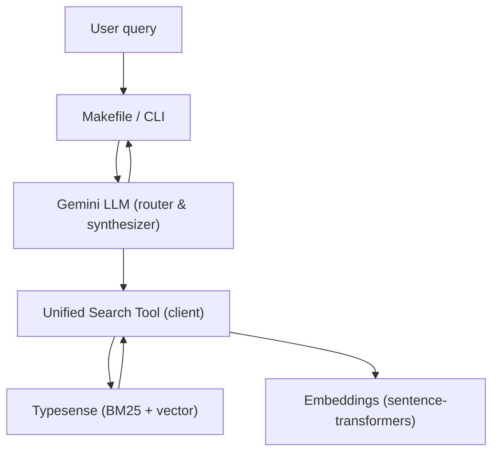
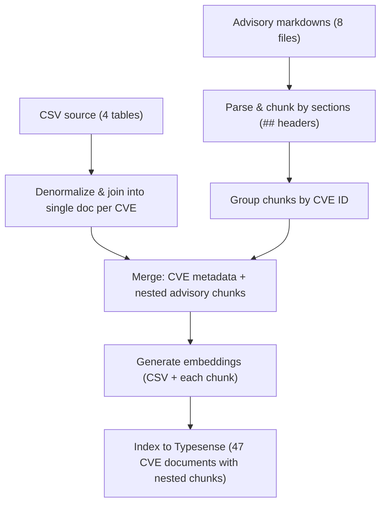

# Hybrid RAG System for Security Vulnerabilities

A compact, production-minded hybrid RAG system that answers plain-English questions about security vulnerabilities by combining structured CVE metadata and unstructured advisory content. The implementation avoids high-level RAG frameworks; the core routing, retrieval and synthesis logic is implemented directly for clarity and auditability.

## Quick start (use the Makefile)

Always use the project's Makefile for setup, ingest, run and tests. The Makefile centralizes environment, dependencies and Docker orchestration so reviewers can reproduce runs reliably.

From the repository root:

```bash
cd solution
make setup    # create venv, install deps, start Typesense
make ingest   # build embeddings and index documents into Typesense
```

Run or test:

```bash
make run                  # interactive CLI
make query Q="<your question>"  # single-query mode
make test                 # run the full test suite (31 unit tests)
make int-tests            # run integration tests (17 comprehensive queries)
```

## Makefile summary

This table shows the most useful targets you'll use during review.

| Command | Purpose |
| --- | --- |
| `make setup` | Full setup: venv + install + docker-up |
| `make install` | Install production deps |
| `make install-dev` | Install dev/test deps |
| `make docker-up` / `make docker-down` | Start / stop Typesense container |
| `make ingest` | Run data ingestion and index 47 CVE documents |
| `make run` | Start interactive CLI (REPL) |
| `make query Q='...'` | Run a single question and exit |
| `make test` | Run 31 unit tests |
| `make int-tests` | Run 17 integration tests (all RAG types) |
| `make lint` / `make format` / `make type-check` | Code quality checks |
| `make clean` / `make reset` | Remove venv / reset Docker state |

## What this project does (short)

- Supports three query types via one unified interface: structured-only (CSV aggregation/filters), unstructured-only (semantic advisory search), and hybrid (both combined).  
- Uses Typesense to index CVE-centric documents (one document per CVE, with nested advisory chunks for rich content search).
- Uses Gemini (configurable via env) to route queries, call the search tool, and synthesize answers with citations.

## Design choices and tech stack

- Search engine: Typesense 29.x (running in Docker). Chosen because it natively supports BM25 keyword search, vector similarity, faceting and aggregations in one system. That lets us issue a single atomic insert per document and run hybrid queries without stitching results across systems.
- LLM: Google Gemini (model configurable via `GEMINI_MODEL` env var) for intent routing and final answer synthesis.
- Embeddings: sentence-transformers/all-MiniLM-L6-v2 (384-dim) — fast CPU inference and small model size.
- Data processing: Polars for CSV joins/denormalization; markdown chunking preserves sentence/code boundaries.

## Technology Stack

**Search Engine**: Typesense 29.0

- Native hybrid search (BM25 + vector), automatic rank fusion
- Faceted search and aggregations
- Running in Docker for reproducibility

**LLM**: Google Gemini 3 (Flash/Pro, configurable)

- Automatic function calling (no prompt engineering)
- Fast inference, large context window
- Configurable via `GEMINI_MODEL` env var

**Embeddings**: sentence-transformers/all-MiniLM-L6-v2

- 384-dimensional vectors, fast CPU inference
- No GPU required

**Data Processing**: Polars, markdown, beautifulsoup4

- Polars: 10-100x faster than pandas for CSV operations
- Markdown parsing and chunking at semantic boundaries

**Infrastructure**: Docker Compose

- Reproducible Typesense setup with health checks
- One-command environment: `make setup`

### Why Typesense? (Design Decision)

We evaluated four major search approaches:

| Approach | Structured | Semantic | Hybrid | Complexity |
| --- | --- | --- | --- | --- |
| PostgreSQL only | ⭐⭐⭐⭐⭐ | ❌ | ❌ | Simple |
| PostgreSQL + pgvector | ⭐⭐⭐⭐⭐ | ⭐⭐⭐⭐ | ⭐⭐⭐ | High |
| **Typesense** | ⭐⭐⭐⭐ | ⭐⭐⭐⭐⭐ | ⭐⭐⭐⭐⭐ | Low |
| SQLite + FAISS | ⭐⭐⭐⭐⭐ | ⭐⭐⭐⭐⭐ | ⭐⭐⭐ | Medium |

**Why Typesense wins:**

- **Native Hybrid Search**: Single query combines BM25 (keyword) + vector similarity with automatic rank fusion. No manual result merging.
- **One Document, Dual-Indexed**: All data in one Typesense collection with both keyword and vector indexes. No metadata duplication.
- **Simple API**: One function call handles keyword search, vector search, filtering, and aggregations.
- **Production Pattern**: Mirrors how organizations use Elasticsearch—proven architecture.

**Why not the others:**

- **PostgreSQL + pgvector**: Duplicate metadata across chunks OR maintain complex joins. Manual result merging needed.
- **SQLite + FAISS**: Two separate systems requiring glue code. FAISS has no filtering—inefficient.
- **PostgreSQL only**: Can't do semantic search.

**Real-world context:** We reviewed public services like Snyk and observed they rely on search engines. This influenced our assumption that a maintained search engine is a reasonable operational dependency for vulnerability search. You can reuse a centralized index rather than running separate SQL and vector stores. In practice, search engines handle semi-structured advisory documents better than raw vector DBs because they combine token-level heuristics (keyword) with embeddings for conceptual matches.

**Additional trade-offs:**

- Elasticsearch is excellent at aggregations and scales well, but requires careful schema and cluster tuning; Typesense gives a simpler path with native vector support.
- PostgreSQL remains the best for heavy analytical SQL workloads, but for hybrid retrieval + filtering + ranking, a search engine reduces glue code and complexity.

## Architecture (overview)



### Data flow (ingest)



### How queries work (ReAct pattern)

The agent uses **ReAct (Reasoning + Acting)** to iteratively search and synthesize answers:

1. **User asks a question** in plain English
2. **Gemini reasons** about what to search for and calls `search_vulnerabilities()` with appropriate parameters
3. **Search tool executes** the right strategy (Gemini automatically chooses):
   - **Keyword search** (BM25) for exact metadata matches → "List all Critical npm packages"
   - **Semantic search** (vector) for conceptual understanding → "Explain SQL injection"
   - **Hybrid** (combined) for questions needing both → "How do I fix CVE-2024-1234?"
4. **Typesense returns** results from 47 CVE documents (automatic rank fusion)
5. **Gemini re-evaluates**: Does it have enough info to answer, or search again? This repeats (up to 5 iterations)
6. **Gemini synthesizes** a final answer with citations (CVE IDs, versions, CVSS scores)
7. **Result shown** to user with sources

**Why ReAct?** The LLM can iterate—ask follow-up searches if the first result wasn't quite right, and decide when to stop. No hardcoded heuristics. This handles ambiguous questions naturally.

## Configuration

Copy `.env.example` into `solution/.env` and set the required keys.

Important vars:

```bash
GOOGLE_API_KEY=...           # Gemini API key
GEMINI_MODEL=gemini-3-flash-preview
VECTOR_SEARCH_K=100          # neighbors for vector search
HYBRID_SEARCH_ALPHA=0.5      # 0=keyword-only, 1=vector-only
LOG_LEVEL=INFO
```

All commands in this repo are designed to run via the Makefile so environment loading and Docker orchestration remain consistent.

## Troubleshooting (common issues)

- Typesense not running: `make docker-up` then `make docker-logs` to inspect logs. Use `make docker-down` then `make docker-up` to restart.
- Port conflicts on 8108: find and kill the process using the port. Prefer changing Docker host mapping if necessary.
- Missing API key: ensure `GOOGLE_API_KEY` is set in `solution/.env` and re-source the file.
- Data not indexed: re-run `make ingest`. If indexing still fails, inspect Typesense collection with curl against `http://localhost:8108/collections`.
- Tests failing: confirm Typesense is healthy (`make health`), re-ingest (`make ingest`) and run `make test`.

## Code structure

```text
solution/
├── main.py                  # CLI entry point (interactive + single-query modes)
├── Makefile                 # All workflows (setup, ingest, run, test, lint)
├── requirements.txt         # Pinned dependencies
├── docker-compose.yml       # Typesense 29.0 container config
├── .env.example             # Configuration template
├── src/
│   ├── agent.py            # Gemini LLM orchestration (routing & synthesis)
│   ├── search_tool.py      # Unified search interface (keyword/semantic/hybrid)
│   ├── ingest.py           # Data pipeline (denormalize, chunk, embed, index)
│   ├── prompts.py          # LLM system prompts and tool declarations
│   ├── logger.py           # Structured logging utilities
│   └── utils.py            # Helper functions (retries, data validation)
└── tests/
    ├── test_agent.py       # Agent initialization and synthesis tests
    ├── test_search_tool.py # Search (keyword/semantic/hybrid/filters/agg)
    └── test_ingest.py      # Ingestion pipeline tests
```

## Key implementation details

### ReAct agent with embedding caching

The agent implements ReAct (Reasoning + Acting):

- Iteratively calls `search_vulnerabilities()` and evaluates results
- Gemini decides when to search again or synthesize an answer
- Max 5 iterations, but typically finishes in 1-3 iterations

**Performance optimization**: The question embedding is computed once and reused across all ReAct iterations.

### Single unified search function

Instead of separate search paths for CSV vs. advisory queries, we expose one `search_vulnerabilities()` with flexible parameters:

```python
search_vulnerabilities(
    query: str,
    search_type: "keyword|semantic|hybrid",  # How to search
    cve_ids, ecosystems, severity_levels,    # Explicit filters
    min_cvss_score, additional_filters,      # Flexible overrides
    facet_by, group_by, sort_by,            # Aggregation & ranking
)
```

Gemini automatically determines the best parameters. No hardcoded parsing rules.

**Note on `group_by`:** Rarely needed with the CVE-centric design. Each CVE is one unique document (no duplicates). Use explicit filters (`ecosystems=["npm", "pip"]`) instead of `group_by` for clarity. Keep `group_by` only if you want to limit results per category (e.g., show at most 3 npm, 3 pip, 3 maven vulnerabilities for diversity).


### CVE-centric document design with nested advisory chunks

Each CVE is a single document containing:

- **Structured fields**: CVE ID, package name, ecosystem, severity, CVSS score, versions, vulnerability type, `has_advisory` (boolean flag)
- **Unstructured fields**: Description (from CSV) + nested advisory chunks array
- **Embedding**: Generated from CSV description
- **Nested advisory_chunks**: Array of objects containing:
  - `content`: Chunk text (preserves code blocks intact)
  - `section`: Semantic category (summary, remediation, code_example, etc.)
  - `is_code`: Boolean flag for code block preservation
  - `index`: Position within the advisory
  - `embedding`: Separate embedding for semantic search

**The `has_advisory` field** is a faceted boolean that distinguishes the 8 CVEs with detailed advisories from the 39 without. Enables queries like:

- `additional_filters="has_advisory:true"` to prioritize CVEs with code examples and remediation steps
- `facet_by="has_advisory"` to analyze documentation coverage (8 documented, 39 metadata-only)

This maintains the **47 vulnerabilities** contract while enabling rich advisory content search. Advisory chunks are nested sub-documents, not separate top-level documents.

### Advisory integration with section-based chunking

The 8 advisory markdown files are parsed with **section-aware chunking**:

1. **Section splitting**: Split advisories by `##` headers to preserve semantic boundaries
2. **Code preservation**: Code blocks (```) are kept intact, never split mid-code
3. **Text chunking**: Non-code sections are split at sentence boundaries (~500 characters max)
4. **Nested storage**: Chunks are grouped by CVE and stored as nested objects within CVE documents

**Benefits:**

- **Analytics integrity**: 47 CVE documents (not 95 separate chunks)
- **Code preservation**: Entire code examples remain searchable as units
- **Semantic search**: Separate embeddings for CSV metadata and advisory chunks
- **Section awareness**: Chunks tagged by type (summary, remediation, attack_vector, etc.)

**Chunking strategy preserves context:**

- Code sections: Never split (preserves syntax highlighting and examples)
- Text sections: Split at sentence boundaries to maintain readability
- Metadata: Each chunk includes section type and position for filtering

## Features & requirements met

✅ **Three query types working:**

- Structured-only: filter/aggregate CVE metadata  
- Unstructured-only: semantic search advisory content  
- Hybrid: combine both with rank fusion

✅ **Natural language interface** — no query syntax, plain English questions  
✅ **Accurate citations** — answers include CVE IDs, versions, CVSS scores  
✅ **Core RAG from scratch** — no forbidden frameworks (LangChain, LlamaIndex, etc.)  
✅ **Comprehensive tests** — 31 unit tests + 17 integration tests, all passing  
✅ **No duplicates** — CVE-centric ingestion ensures 47 unique documents  
✅ **Production-ready** — Docker Compose, env config, error handling, logging

## Performance

**Ingestion**: 10-15 seconds (CSV denormalization + advisory merging + embeddings + indexing)

**Queries**: 1.5-4 seconds total

- Typesense search: 20-100ms
- Gemini synthesis: 1-3 seconds

**Data**: 47 CVE documents (each with metadata + nested advisory chunks from 8 advisory files)

**Search**: Hybrid (BM25 + vector) across CVE metadata + nested advisory chunks

**Resources**:

- Memory: 500MB-1GB
- Storage: 50MB (Typesense index)


## Where to start reviewing

1. **Run it first:**

   ```bash
   cd solution
   make setup
   make ingest
   make run    # ask a question
   ```

2. **Run tests:**

   ```bash
   make test       # 31 unit tests
   make int-tests  # 17 integration tests (all RAG types)
   ```

3. **Understand the flow:**

   - `src/agent.py` — main orchestration logic
   - `src/search_tool.py` — unified search implementation
   - `src/ingest.py` — how data gets into Typesense

4. **Review the code:**

   - Start with `src/agent.py` for the orchestration pattern
   - Check `src/search_tool.py` for the unified search interface
   - See `src/ingest.py` for CVE-centric document merging and embedding generation

5. **Verify the changes:**

   ```bash
   make test       # 31 unit tests covering all functionality
   make int-tests  # 17 integration tests: 6 structured + 5 unstructured + 6 hybrid
   ```

---

## Production Considerations

This codebase is a working demonstration of a hybrid RAG system designed for a code challenge. For production deployment, several important enhancements would be necessary:

### Observability & Monitoring

**Current state**: Basic structured logging to stderr.

**Production additions**:

- **LLM observability** (LangSmith, LangFuse): Trace all Gemini calls, function invocations, token usage, and latencies
- **Search metrics**: Track Typesense query performance, index size, vector search latency
- **Application metrics**: Prometheus/Grafana for query throughput, error rates, end-to-end latency
- **Request tracing**: OpenTelemetry for distributed tracing across services
- **Cost tracking**: Monitor API spending (Gemini tokens, Typesense queries)

### Agent Intelligence

**Current state**: Single-turn queries, no context management.

**Production additions**:

- **Conversation memory**: Long-term (persistent DB) and short-term (context window) memory
- **Refinement loop**: Allow users to ask follow-up questions with context
- **Confidence scoring**: Surface uncertainty when results are ambiguous
- **Query rewrites**: Automatically expand/clarify user questions before search
- **Result ranking**: Custom ranking based on user feedback and domain expertise

### Error Handling & Safeguards

**Current state**: Basic retries with backoff, minimal validation.

**Production additions**:

- **Rate limiting**: Protect Typesense and Gemini APIs from overload
- **Input validation**: Sanitize/validate user queries before processing
- **Output validation**: Verify LLM responses contain citations and factual claims
- **Fallback strategies**: Graceful degradation (keyword-only if semantic fails, cached results, etc.)
- **Audit logging**: Record all queries, answers, and user feedback for compliance
- **PII detection**: Flag sensitive data in results before returning to users

### Framework & Code Organization

**Current state**: Low-level libraries (google-genai, typesense-python), manual orchestration.

**Production additions**:

- **High-level framework**: LangChain, LlamaIndex, or Haystack for cleaner abstraction
- **Better prompt management**: Prompt versioning, A/B testing, dynamic prompt selection
- **Structured outputs**: Pydantic models for LLM response validation
- **MCP Server deployment**: Expose as Model Context Protocol server for integration with other tools
- **Configuration as code**: Centralized config management instead of env vars

### Testing & Evaluation

**Current state**: 31 unit/integration tests.

**Production additions**:

- **End-to-end tests**: Real Gemini API calls with recorded responses
- **RAG evaluations**: Measure retrieval quality (precision, recall, NDCG)
- **Answer quality metrics**: BLEU, ROUGE, semantic similarity to ground truth
- **Regression tests**: Catch answer quality degradation with new LLM versions
- **User feedback loop**: Explicit rating system to improve models
- **A/B testing framework**: Test different prompts, search strategies, ranking approaches

### Deployment & Operations

**Current state**: Docker Compose for local Typesense, Makefile for development.

**Production additions**:

- **Kubernetes/cloud deployment**: Scale Typesense cluster, manage Gemini API quotas
- **CI/CD pipeline**: Automated testing, linting, type checking on every commit
- **Monitoring dashboards**: Real-time visibility into query latency, error rates, costs
- **Alerting**: Notify ops when error rates spike or latency degrades
- **Secrets management**: HashiCorp Vault or cloud provider secrets manager
- **Load testing**: Ensure system handles expected query volume
- **Backup/recovery**: Regular snapshots of Typesense index

### Search & Retrieval Enhancements

**Current state**: Single keyword/semantic/hybrid search types with faceting by ecosystem, severity, CVE ID, and has_advisory.

**Potential future improvements** (evaluated and deemed lower priority):

- **Embedding compression (8-bit quantization)**: Would reduce vector storage by 97% (384 dims → 384 bytes per embedding). Current dataset is tiny (48 advisory chunks + 47 CVE embeddings = ~50KB total), so negligible benefit.
- **Temporal facets (published_year, published_month)**: Dataset spans only 9 months (Jan-Sep 2024), insufficient diversity for meaningful time-based analysis.
- **Section-level faceting**: Advisory chunks already tagged by section (summary, remediation, code_example, etc.) and searchable via filters. Faceting by section would show "100% have remediation" since all advisories follow standard template.
- **Query expansion with security synonyms**: Useful for larger datasets with domain terminology variation. With 34 vulnerability types and 8 advisory documents, the dataset is too small to justify the complexity.
- **Multi-granularity embeddings (document + section + sentence)**: Would enable "show code examples for XSS" queries. Current section-based chunking (48 advisory chunks) already provides sentence-level retrieval precision without complexity overhead.
- **Result re-ranking**: Useful when source order diverges from relevance. Typesense's native rank fusion (BM25 + vector with configurable alpha) typically provides strong ordering; custom re-ranking would require labeled training data.

### Why These Aren't Included

Adding all these features would require **considerable effort** and increase the codebase size by 5-10x:

- Observability libraries add infrastructure complexity and vendor dependencies
- Memory management requires persistent storage design and context window optimization
- Production safeguards need domain expertise and regulatory knowledge
- High-level frameworks improve code clarity but hide implementation details (counter to "core logic from scratch" requirement)
- Comprehensive testing requires labeled datasets and metric definitions
- Search enhancements are optimizations for scale (1M+ documents) and are premature on a 47-CVE dataset
